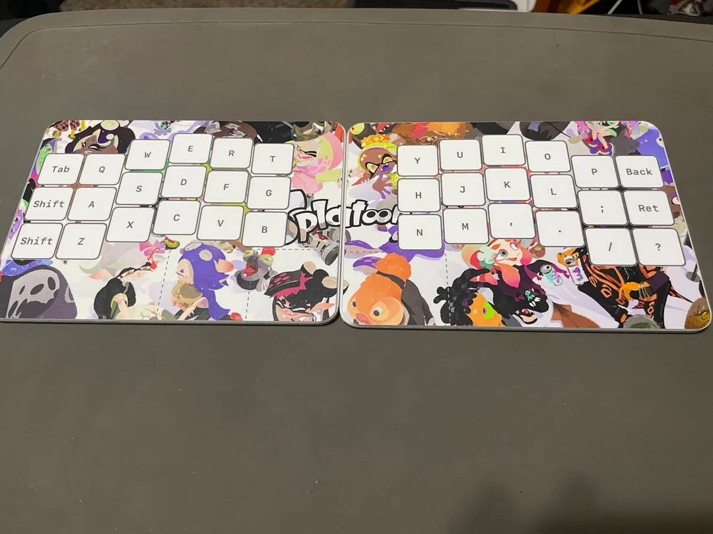

# Apple Magic TouchstreamLP
Consolidating GlassToKey and GlassToKeyForWindows into 1 repo with a more descriptive name! 

## Mac: **(Packaged with .APP)**
- Built on top of the wonderful:
- https://github.com/Kyome22/OpenMultitouchSupport

*The app will ask for elevated Accessibility permissions on first run*

## Windows: **(PREREQUISITE INSTALL)**
- Built on top of the Official Apple Bootcamp drivers:
- **Please follow the <a href="windows/GlassToKey/INSTALL.md" target="_NEW">DRIVER INSTALL GUIDE</a>!**

*If you use an open source driver based on `imbushuo/mac-precision-touchpad`, you will need to change the device decoder in the GUI but it is still supported! * **Pressure && Haptics only supported on Official drivers***

## Usage
I have posted a <a href="https://github.com/disarmyouwitha/AppleMagicTouchstreamLP/releases/tag/beta">Beta Release</a> with a **.app** and **.exe** file and hopefully people will be able to run it!

It can't hurt to submit an Issue or PR but this is just a fun side project I am working on with Codex, so it's something you might have to fork and extend! 

**Useful Tips:**
- I would turn off "tap to click" at the OS level, and turn it on within the app! (Or turn on Keyboard mode)
- If you turn on Keyboard mode you can toggle between mouse / keyboard (Rather than mouse / mixed)
- 5-finger left/right swipes will toggle Typing Mode on/off!
- If Chordal Shift is enabled, placing 4 fingers on 1 side will shift characters on the other side 
- If Snap Radius is enabled, taps near keys (but not on them) will snap to the nearest key during typing

**Windows Pin Tray Icon**
- You can drag the icon from the hidden tray (`^`) to the visible tray area.

**Windows Haptics**
- Working over USB-C!!!
- Only works over USB-C. =x **I do not see a path forward!** 

## Intention

The Fingerworks TouchStreamLP was a flat, zero-force, gesture keyboard developed for people with RSI in 2002 — it was way before it’s time, and it was *totally rad* FingerWorks was acquired by Apple in 2005 and the TouchStreamLP was immediately discontinued, the technology becoming the basis for the iPhone’s touchscreen in 2007.

**——So here we are——:** it has come full circle. ⭕️

I have been working to revive this ancient keyboard using the DNA of it’s own lineage — the Apple Magic Trackpad.

Since it is built on the same technology, I thought it would be fun to try and create an open source version!

## FUTURE:
Lots to do in the TODO! For now I have plenty to do to get feature parity between OSX and WIN and to really hone the controls~

TBH I think the Windows re-write is turning out much better so I will need to refocus my attention on Mac soon! xD
