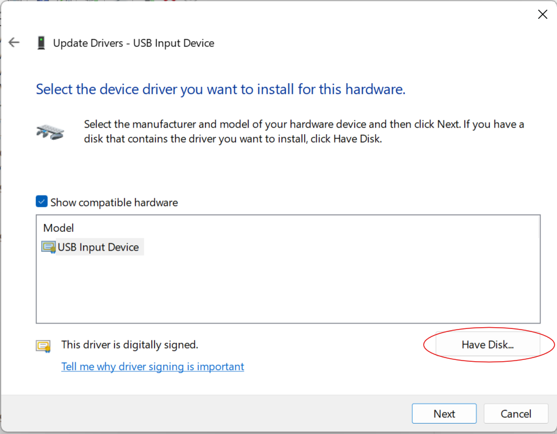

# Install Guide
You will need to install the driver for both USB and for Bluetooth! (For each Apple Magic Trackpad)

## Do you have drivers installed for your trackpad already??
- Go to a web page and try to 2-finger scroll. 
- If you can move your mouse and you can scroll with a 2-finger scroll gesture — you already have drivers installed! **(You should be able to start GlassToKey and select one of the decoders to see your touches.)**
- ^The Official Apple driver is considered first-class by default. You may have issues with Capture/Record or other features if you are not using the Official drivers, however, any Opensource driver based off of `imbushuo/mac-precision-touchpad` should work!

**If you can move your mouse but you can't scroll with a gesture — perfect!** *You need to install drivers:*

## Install Official Apple Bootcamp drivers

**For LIGHTNING:** I think you can just right-click the `.INF` files and click `Install`

**For USB-C, or if the above does not work**

### USB:
1. Connect your trackpad via USB, then open device manager.
    The trackpad should work like a buggy trackpad (can only move cursor and left click)

2. Select `View-> devices by container`

3. Find `Magic Trackpad` (You can easily find it since it's not working.)

4. Ignore the alert mark, select the USB Input Device with the HardwareID `USB\VID_05AC&PID_0324&REV_0410&MI_01`

5. **Install the driver:**
- Click `Update`, then `Browse my Computer for Drivers`

- Click `Let me pick from a list of available drivers on my computer`

- Click `Have Disk...`

- Select the `.INF` from the folder you downloaded `MagicTrackpad2_Precision_Drivers\ApplePrecisionTrackpadUSB`

### Bluetooth:
- You can basically follow the steps above, but you are looking for a Hardware ID that starts with `BTHENUM\{00001124`
- And you will install the `.INF` from `MagicTrackpad2_Precision_Drivers\ApplePrecisionTrackpadBluetooth`!

## If my guide was not clear enough, I apoloigize.
Hopefully you can follow the instructions from here:
- https://github.com/vitoplantamura/MagicTrackpad2ForWindows/issues/30