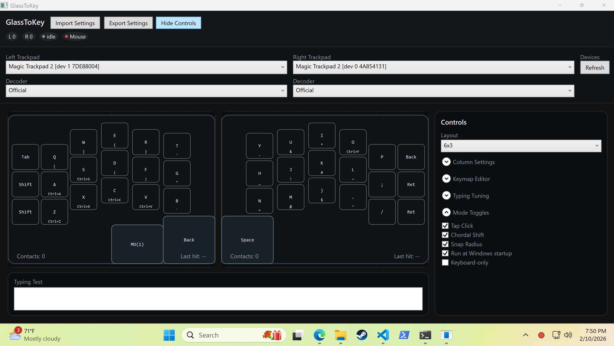

## GlassToKey
GlassToKey for Windows.

## Intention
An attempt to use the Apple Magic Trackpad as a keyboard (and mouse!) like the TouchStream LP~
Since it is built on the same technology, I thought it would be fun to try and create an open source version!


It's just Codex and I vibe coding~ You can submit an issue but this is really just a repo for me, you might have to fork and extend!

## Usage

Build the GlassToKey project and you are good to go! A status bar indicator shows the active mode:
- **Green**: Mixed mode (typing + mouse intent)
- **Purple**: Keyboard mode (full keyboard, no mouse intent)
- **Red**: Mouse-only mode (typing disabled)

Clicking the indicator light will allow you to view the Config or Quit the program.



### Mobile QWERTY Preset
- `Mobile QWERTY` is a special preset.
- Left trackpad is intentionally blank.
- Right trackpad uses a fixed row-staggered QWERTY geometry at 75% key scale.
- Column scale/offset tuning is disabled for this preset (other presets are unchanged).

## Typing Tuning
- Hold duration (ms): Time in miliseconds until a tap becomes a hold
- Typing Grace (ms): Time after a key dispatch to keep typing intent active.
- Drag cancel (mm): How far you need to move before tap becomes a drag
- Intent Move (mm): Movement threshold before a touch is treated as mouse intent.
- Intent Velocity (mm/s): Speed threshold before a touch is treated as mouse intent.
- Tap Click: two-finger tap = left click, three-finger tap = right click
- Snap Radius: On release during typing intent, off-key taps will snap to the nearest key center if the release point is within this percent of the key’s smaller dimension.
- Keyboard Mode: When enabled, the typing toggle (and 5‑finger swipe) switches between **full keyboard** and **mouse‑only**. In keyboard mode, mouse down/up events are blocked globally (except inside the GlassToKey config window) and tap‑click gestures are disabled. Blocking clicks requires Input Monitoring/Accessibility permission.

## Intent State Machine
GlassToKey runs a simple intent state machine to decide when touches should be interpreted as typing vs mouse input. The UI intent badges use these labels: `idle`, `cand`, `typing`, `mouse`, `gest`.

- **Idle (`idle`)**: No active contacts. Any touch that begins on a key enters `keyCandidate`; otherwise it enters `mouseCandidate`.
- **KeyCandidate (`cand`)**: A short buffer window (fixed at 40ms) watches for mouse-like motion. If the touch stays within thresholds, it becomes `typingCommitted`.
- **TypingCommitted (`typing`)**: Key dispatches are allowed. Typing Grace keeps this state alive for a short window after a key is released.
- **MouseCandidate (`mouse`)**: Short buffer window (fixed at 40ms) watching for mouse-like motion. If motion exceeds thresholds or the buffer elapses, it becomes `mouseActive`.
- **MouseActive (`mouse`)**: Typing is suppressed while mouse intent is active.
- **GestureCandidate (`gest`)**: Multi-finger gesture guard. If 2+ touches begin within the 40ms buffer (or 3+ touches arrive together), typing is suppressed and intent displays as gesture until the contact count drops.

Transitions and notes:
- **Typing Grace** extends `typingCommitted` after a key dispatch, even if all fingers lift.
- **Tap/Drag** immediately disqualifies the touch and forces `mouseActive`.
- **GestureCandidate** enters when 2+ touches start within the key buffer window (or 3+ simultaneous touches) and exits back to `idle` once fewer than two contacts remain.

## Build
```
dotnet build GlassToKey\GlassToKey.csproj -c Release
```

## Run
```
dotnet run --project GlassToKey\GlassToKey.csproj -c Release
```

- Default live launch starts in tray mode (status app) without opening the visualizer.
- Use the tray icon `Open Config` action or `--config` to open the visualizer immediately.

### Pin Tray Icon
- Windows 11:
  - `Settings` -> `Personalization` -> `Taskbar` -> `Other system tray icons` -> turn on `GlassToKey`.
- Windows 10:
  - `Settings` -> `Personalization` -> `Taskbar` -> `Select which icons appear on the taskbar` -> turn on `GlassToKey`.
- You can also drag the icon from the hidden tray (`^`) to the visible tray area.

### Optional arguments
- `--maxx <value>` / `--maxy <value>`: Force coordinate scaling.
- `--config`: Open config visualizer on startup (live runtime remains tray-hosted).
- `--list`: Print available HID interfaces.
- `--capture <path>`: Write captured reports to binary `.atpcap` format.
- `--replay <capturePath>`: Replay a capture without opening the UI.
- `--replay-ui`: When used with `--replay`, opens UI playback mode (instead of headless replay).
- `--replay-speed <x>`: Initial replay speed multiplier (for example: `0.5`, `1`, `2`).
- `--fixture <fixturePath>`: Optional expected replay fingerprint/counts JSON (also supports intent fingerprint + transition count).
- `--metrics-out <path>`: Write metrics JSON snapshot.
- `--replay-trace-out <path>`: Write detailed replay trace JSON (intent transitions, dispatch events, diagnostics).
  - Dispatch events/diagnostics include `dispatchLabel` (for example `A`, `TypingToggle`, `Ctrl+C`, `ChordShift`) for direct intent debugging.
  - Diagnostics include `ReleaseDropped` reasons (`drag_cancel`, `off_key_no_snap`, `tap_gesture_active`, `hold_consumed`) when a touch release does not emit a key dispatch.
- `--raw-analyze <capturePath>`: Analyze captured raw HID packets and print report signatures + decode classification.
- `--raw-analyze-out <path>`: Write raw analysis JSON output.
- `--selftest`: Run parser/replay smoke tests and exit.

## Files Created at Runtime
- `%LOCALAPPDATA%\\GlassToKey\\settings.json`: device selections + active layer.
- `%LOCALAPPDATA%\\GlassToKey\\keymap.json`: layered keymap overrides.
- `%LOCALAPPDATA%\\GlassToKey\\runtime-errors.log`: guarded runtime exception log (raw input/device context + stack traces).
- On first run (no local settings/keymap), defaults are loaded from `GLASSTOKEY_DEFAULT_KEYMAP.json` beside the executable.

## Files
- `App.xaml` / `App.xaml.cs`: App bootstrap + exception dialog.
- `StatusTrayController.cs`: tray icon/menu (`Open Config`, `Exit`).
- `TouchRuntimeService.cs`: background runtime host for WM_INPUT + engine + dispatch.
- `RuntimeObserverContracts.cs`: runtime mode + frame observer contracts for live visualization mirroring.
- `RuntimeConfigurationFactory.cs`: shared settings-to-layout/config builders for UI/runtime parity.
- `StartupRegistration.cs`: Windows startup (`HKCU\\...\\Run`) registration helper.
- `MainWindow.xaml` / `MainWindow.xaml.cs`: secondary config/visualizer UI (plus replay UI path).
- `RawInputInterop.cs`: Raw Input registration + device enumeration.
- `PtpReport.cs`: zero-allocation report parsing.
- `Core/Input/InputFrame.cs`: fixed-capacity frame/contact structs for engine handoff.
- `Core/Engine/*`: touch table, binding index, action model, `TouchProcessor` core + actor queue.
- `Core/Diagnostics/*`: capture format, replay runner, self-tests, frame metrics.
- `TouchState.cs`: Thread-safe state container.
- `TouchView.cs`: WPF drawing.
